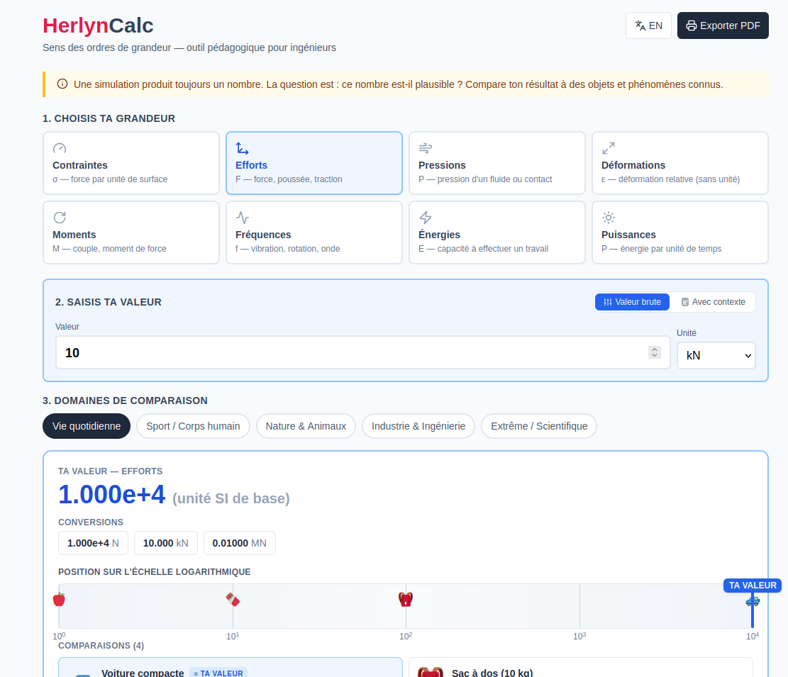

# HerlynCalc

> **Make sense of orders of magnitude.** A pedagogical web tool for junior engineers, to avoid drawing hasty conclusions from simulation results.


## 🎯 What it does

A simulation always produces a number. The real question is: *is it plausible?*

HerlynCalc takes a value (raw, or computed from physical context) across **8 categories** — stresses, forces, pressures, strains, torques, frequencies, energies, powers — and compares it to known objects and phenomena across **5 domains**: daily life, sport, nature, industry, and extreme scientific.

Each comparison comes with:
- Multi-unit conversions
- A logarithmic visual scale showing where your value sits
- Ranked "closest match" cards with concrete examples
- Engineering tip
- Bilingual UI (FR / EN)
- Native PDF export



### 📦 Deployment

## 🌐 Live demo

👉 **[herlyncalc.vercel.app](https://herlyn-calc.vercel.app/)** 

The site is deployed on **Vercel** with automatic deployment from the `main` branch.
Any push to `main` triggers a redeploy within ~2 minutes.

## 🛠 Deploy your own copy

Want to fork and host your own instance? The project works out of the box on:

- **Vercel** (recommended) — auto-detects Vite, zero config
- **Netlify** — build command: `npm run build`, publish dir: `dist`
- **Any static host** — just upload the `dist/` folder after `npm run build`

### GitHub Pages

Add a workflow in `.github/workflows/deploy.yml` (see template in this repo) and enable Pages on the `gh-pages` branch.

## 🛠 Tech stack

- **React 18** with functional components and hooks
- **Vite 5** for fast dev and optimized build
- **Tailwind CSS 3** for utility-first styling
- **lucide-react** for icons
- Inline SVG for technical schematics
- `window.print()` + `@media print` CSS for PDF export

## 📁 Project structure

```
HerlynCalc/
├── index.html
├── package.json
├── vite.config.js
├── tailwind.config.js
├── postcss.config.js
├── public/
│   └── favicon.svg
└── src/
    ├── main.jsx          # React entry point
    ├── index.css         # Tailwind directives
    └── HerlynCalc.jsx    # The whole app (~600 lines)
```

## 🤝 Contributing

Suggestions, references to add, translations, and bug reports are welcome. Open an issue or a PR.

## 📜 License

MIT © Herlyn Claude Magaya Mapaga

## 🙏 Acknowledgments

Developed with the assistance of Claude (Anthropic). The pedagogical idea came from observing that junior engineers often lack intuition for orders of magnitude, which is a major source of unnoticed errors in simulation interpretation.
